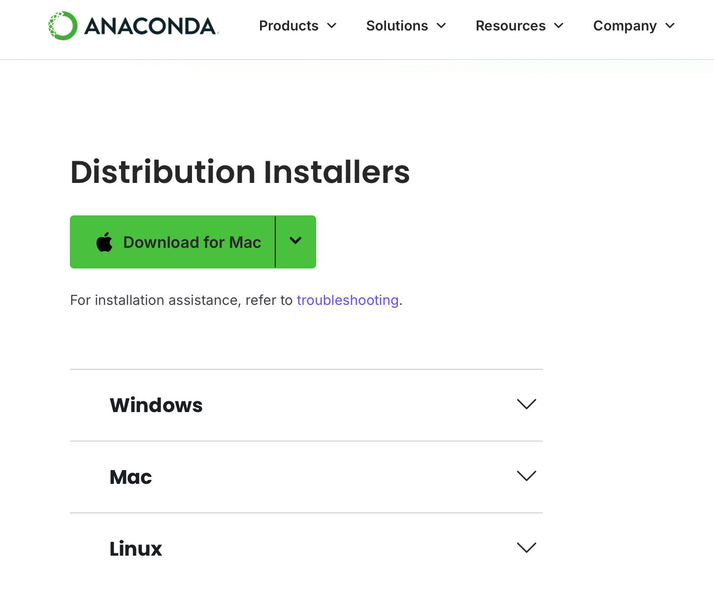
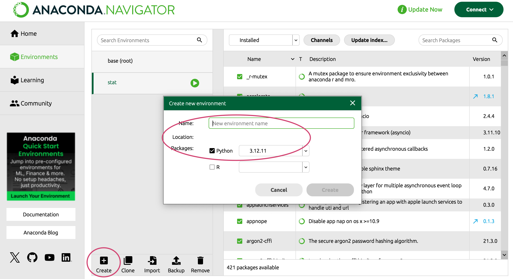

# Anaconda Environment Setup


Anaconda is a widely used **distribution of Python and R for data science and machine learning**. It comes with a large collection of pre-installed packages, a user-friendly interface, and tools for managing environments and dependencies.

**Key features**

- **Environment Management** – Create, manage, and switch between isolated environments.  
- **Graphical User Interface (GUI)** – **Anaconda Navigator** offers an intuitive interface to manage packages and environments.  
- **Built-in IDEs** – Includes IDEs such as **Spyder** and **Jupyter Notebook**.

---


## Install Anaconda

1. Go to the [official Anaconda website](https://www.anaconda.com/download/success).
2. Download the appropriate installer for your operating system (Windows, macOS, or Linux).


> **Tip:** Anaconda takes up considerable disk space. Make sure you have enough storage before installing it. 
> On Windows, it’s best **not to** install it on the system drive (e.g., the `C:` drive).  


 

---


## Manage Environment

**Conda environments are one of the key features of Anaconda.**

They allow you to create isolated environments with different Python versions and corresponding package versions for specific tasks. This is especially useful when a particular package requires a specific version of Python or other dependencies. By creating a new environment, you can install and manage the required tools without affecting your base environment or other projects.


### View all environments
```bash
conda env list
# or
conda info --envs
```


### Create a new environment (command line)
```bash
conda create -n myenv python=3.11
```
Here, `myenv` is the environment name and `python=3.11` specifies which Python version to install.


### Create an environment via GUI
If you prefer a GUI:
1. Open **Anaconda Navigator**.  
2. Go to the **Environments** tab.  
3. Click **Create**.  
4. Enter a name and select a Python version.  
5. Click **Create**.

 


### Activate the Environment

To activate the environment you just created:

```bash
conda activate myenv
```

Once activated, you can verify the Python version in the environment:
```bash
python --version
```


### Start the Python Interpreter

After activating your environment, you can start the Python interpreter by simply typing:
```bash
python
```

This will open the interactive Python shell. You’ll see something like this:
```plaintext
Python 3.12.7 | packaged by Anaconda, Inc. | ...
Type "help", "copyright", "credits" or "license" for more information.
>>> 
```


### Exit the Python Interpreter

To exit the Python interpreter, type:
```python
exit()
# or
quit()
```


### Deactivate the Environment//

To exit the current environment:

```bash
conda deactivate
```